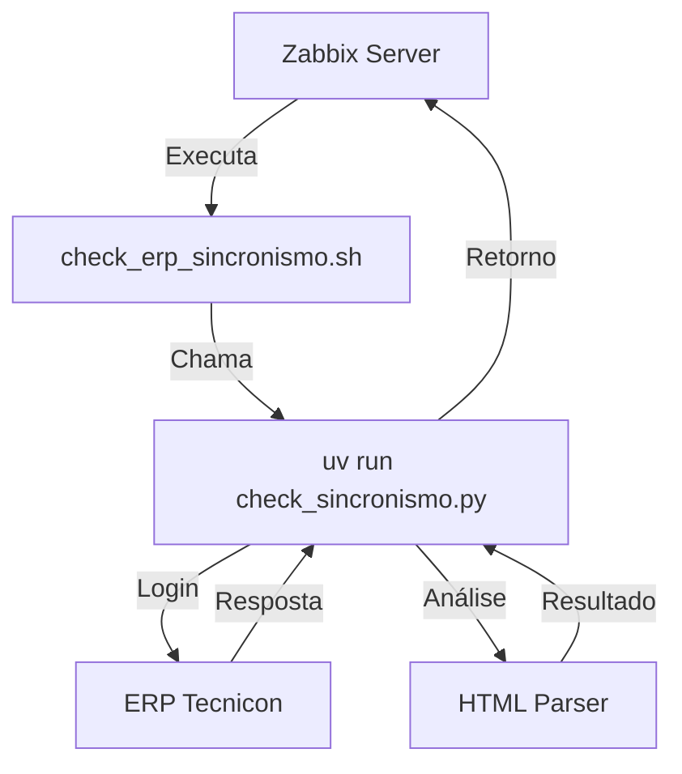

# Documentação Técnica - Monitoramento de Sincronismo ERP

## 📋 Visão Geral

Este documento descreve a arquitetura técnica, fluxo de execução e detalhes de implementação do sistema de monitoramento de sincronismo ERP para Zabbix.

## 🏗️ Arquitetura do Sistema

### Componentes Principais



### Estrutura de Arquivos

```
zabbix_erp_sincronismo/
├── check_sincronismo.py          # Script principal
├── encrypt_password.py           # Criptografia de senhas
├── tests/
│   └── test_check_sincronismo.py # Suite de testes
├── logs/                         # Logs com rotação diária
├── docs/                         # Documentação técnica
├── .env                          # Configurações (não versionado)
├── .env.example                  # Template de configurações
├── setup.sh                      # Script de instalação
└── requirements.txt              # Dependências Python
```

## 🔧 Configurações Técnicas

### Variáveis de Ambiente

| Variável | Descrição | Valor Padrão | Obrigatório |
|----------|-----------|--------------|-------------|
| `ERP_BASE_URL` | URL base do ERP | `http://erpdireto:8080` | ✅ |
| `ERP_USERNAME` | Usuário de monitoramento | `MONITORSINCRONISMO` | ✅ |
| `MAX_SECONDS_DELAY` | Limite de atraso em segundos | `300` | ❌ |

### Arquivos de Configuração

#### `.env`
Arquivo de configuração local que não deve ser versionado. Contém as configurações específicas do ambiente.

#### `.env.example`
Template de exemplo para criação do arquivo `.env` real.

#### `pyproject.toml`
Configuração do projeto Python com uv:

```toml
[project]
name = "zabbix-erp-sincronismo"
version = "1.0.0"
dependencies = [
    "requests>=2.32.0",
    "beautifulsoup4>=4.12.0",
    "lxml>=5.3.0",
    "cryptography>=43.0.0",
    "python-logrotate>=0.1.0",
]
```

## 🚀 Fluxo de Execução

### 1. Inicialização

```python
# Configuração de logging
setup_logging()  # logs/g70k_YYYY_MM_DD.log

# Carregamento de configurações
load_dotenv()
base_url = os.getenv('ERP_BASE_URL')
username = os.getenv('ERP_USERNAME')
max_delay = int(os.getenv('MAX_SECONDS_DELAY', '300'))
```

### 2. Processo de Login

```python
# Descriptografa senha
password = decrypt_password()

# Realiza login
session = requests.Session()
login_response = session.post(f"{base_url}/login", data={...})

# Verifica se há seleção de empresa
if "tblBody" in login_response.text:
    select_empresa(session, base_url, login_response.text)
```

### 3. Análise de Tabelas

```python
# Encontra todas as tabelas
tables = soup.find_all('table')

# Identifica tabela de sincronismo
for idx, table in enumerate(tables):
    rows = table.find_all('tr')
    if len(rows) > 1 and contains_sync_terms(table):
        sync_table = table
        break
```

### 4. Detecção de Erros

#### Critérios de Erro

| Tipo | Indicador | Exemplo |
|------|-----------|---------|
| Status HTTP | Texto "500" | `"500"` |
| Fundo Amarelo | `style="background-color: yellow"` | Célula destacada |
| Texto de Erro | Palavras-chave | `"ERRO"`, `"PROBLEMA"`, `"INVÁLIDO"` |
| Classe CSS | Classes de erro | `"error"`, `"status-error"` |

#### Algoritmo de Detecção

```python
def detect_errors_in_cell(cell):
    text = cell.get_text(strip=True)
    style = cell.get('style', '')
    class_name = cell.get('class', [])
    
    # Verifica status HTTP
    if text == '500':
        return True, 'status_http'
    
    # Verifica fundo amarelo
    if 'background-color: yellow' in style:
        return True, 'background_error'
    
    # Verifica texto de erro
    error_keywords = ['ERRO', 'PROBLEMA', 'INVÁLIDO', 'FALHA']
    if any(keyword in text.upper() for keyword in error_keywords):
        return True, 'text_error'
    
    # Verifica classes CSS
    error_classes = ['error', 'status-error']
    if any(ec in class_name for ec in error_classes):
        return True, 'css_error'
    
    return False, None
```

## 📊 Formato de Saída

### STATUS_OK
```
STATUS_OK
```
**Código de retorno:** 0

### STATUS_PROBLEMA
```
STATUS_PROBLEMA: [CÓD_FILIAL]: STATUS | MENSAGEM_ERRO | 
```
**Código de retorno:** 1

**Exemplo real:**
```
STATUS_PROBLEMA: [4]: 500 | RECEBE: PROBLEMA REGISTRO RECEBIDO 2 : LOCAL: 4XML possui caracter inválido na linha 48 coluna 568 - Detalhes: An invalid XML character (Unicode: 0x2) was found in the value of attribute "HISTORYC" and element is "ROW". | 
```

## 🔐 Segurança

### Criptografia de Senha

```python
from cryptography.fernet import Fernet

def encrypt_password(password: str) -> tuple[str, str]:
    key = Fernet.generate_key()
    cipher = Fernet(key)
    encrypted = cipher.encrypt(password.encode())
    return key.decode(), encrypted.decode()
```

### Permissões de Arquivos

- **Arquivo de chave**: `600` (leitura/escrita apenas para o proprietário)
- **Arquivo de senha criptografada**: `600`
- **Logs**: `644` (leitura para todos, escrita apenas para o proprietário)

## 🧪 Testes

### Suite de Testes

```python
# tests/test_check_sincronismo.py
class TestCheckSincronismo(unittest.TestCase):
    
    def test_parse_status_page_with_errors(self):
        # Testa detecção de erros em múltiplas linhas
        
    def test_parse_status_page_without_errors(self):
        # Testa página sem erros
        
    def test_empty_table_handling(self):
        # Testa tratamento de tabela vazia
        
    def test_multi_table_detection(self):
        # Testa identificação correta da tabela de sincronismo
```

### Execução dos Testes

```bash
# Executar todos os testes
uv run pytest tests/

# Executar teste específico
uv run python tests/test_check_sincronismo.py

# Com cobertura
uv run pytest tests/ --cov=.
```

## 📋 Logging

### Configuração do Log

```python
import logging
from logrotate import RotatingFileHandler

def setup_logging():
    handler = RotatingFileHandler(
        'logs/g70k_{}.log'.format(datetime.now().strftime('%Y_%m_%d')),
        maxBytes=10*1024*1024,  # 10MB
        backupCount=30
    )
    
    formatter = logging.Formatter(
        '%(asctime)s - %(name)s - %(levelname)s - %(message)s'
    )
    handler.setFormatter(formatter)
    
    logger = logging.getLogger('zabbix_erp_sincronismo')
    logger.setLevel(logging.INFO)
    logger.addHandler(handler)
```

### Níveis de Log

- **INFO**: Informações gerais do processo
- **WARNING**: Avisos sobre possíveis problemas
- **ERROR**: Erros que impedem a execução
- **DEBUG**: Informações detalhadas (não usado em produção)

## 🔍 Debug e Troubleshooting

### Salvamento de HTML para Análise

```python
# Quando há problemas na análise, o HTML é salvo
debug_file = tempfile.NamedTemporaryFile(
    mode='w', 
    suffix='.html', 
    delete=False,
    prefix='tmp'
)
debug_file.write(html_content)
debug_file.close()
logger.info(f"HTML salvo em {debug_file.name} para análise detalhada")
```

### Verificação de Permissões

```bash
# Verificar permissões dos arquivos de chave
ls -la *.key

# Verificar permissões dos arquivos de senha
ls -la *.bin

# Verificar logs recentes
tail -f logs/g70k_$(date +%Y_%m_%d).log
```

## 📈 Performance

### Métricas de Execução

- **Tempo médio de execução**: ~5-10 segundos
- **Timeout de requisições**: 30 segundos
- **Retry de login**: 3 tentativas
- **Cache de sessão**: Reutiliza sessão por execução

### Otimizações

1. **Reutilização de sessão HTTP**: Mantém cookies de autenticação
2. **Parsing eficiente**: Usa BeautifulSoup com parser lxml
3. **Early exit**: Retorna imediatamente ao encontrar erros
4. **Regex otimizado**: Compila padrões uma vez

## 🔧 Manutenção

### Atualização do Script

```bash
# No servidor Zabbix
cd /usr/lib/zabbix/externalscripts/zabbix_erp_sincronismo
sudo git pull
sudo bash setup.sh
```

### Limpeza de Logs

```bash
# Logs antigos são removidos automaticamente (30 dias)
# Para limpeza manual:
find logs/ -name "g70k_*.log" -mtime +30 -delete
```

## 📚 Referências

- [BeautifulSoup Documentation](https://www.crummy.com/software/BeautifulSoup/bs4/doc/)
- [Requests Documentation](https://docs.python-requests.org/)
- [Python Logging](https://docs.python.org/3/library/logging.html)
- [Zabbix External Scripts](https://www.zabbix.com/documentation/current/manual/config/items/itemtypes/external)